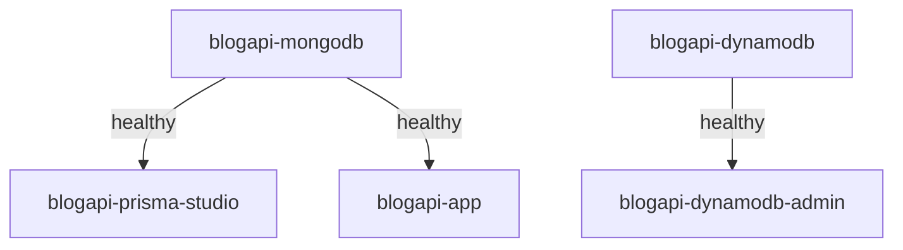

# 🐳 Guia Completo - Docker Compose BlogAPI

> **✨ Documentação Única e Consolidada**  
> Este é o guia completo sobre Docker do projeto BlogAPI. Todo conteúdo sobre nomenclatura, labels, configuração, troubleshooting e boas práticas foi unificado aqui para facilitar a consulta.

## 📋 Índice

1. [Visão Geral](#-visão-geral)
2. [Arquitetura](#-arquitetura)
3. [Serviços Configurados](#-serviços-configurados)
4. [Nomenclatura Profissional](#-nomenclatura-profissional)
5. [Health Checks](#-health-checks)
6. [Labels Descritivas](#-labels-descritivas)
7. [Volumes e Persistência](#-volumes-e-persistência)
8. [Redes](#-redes)
9. [Comandos Úteis](#-comandos-úteis)
10. [Troubleshooting](#-troubleshooting)

---

## 🎯 Visão Geral

O `docker-compose.yml` do projeto BlogAPI foi desenvolvido seguindo **melhores práticas profissionais** com foco em:

✅ **Clareza** - Nomes descritivos e consistentes  
✅ **Manutenibilidade** - Labels e documentação inline  
✅ **Confiabilidade** - Health checks em todos os serviços  
✅ **Organização** - Estrutura por camadas (data/backend/tools)  
✅ **Escalabilidade** - Fácil adicionar novos serviços  

### Filosofia de Design

```
Princípio: "Um desenvolvedor deve entender o propósito de cada recurso
apenas olhando seu nome e labels no Docker Desktop"
```

---

## 🏗️ Arquitetura

### Estrutura do Ambiente

```
📦 blogapi (Projeto)
  │
  ├── 🗄️ DATA LAYER (Camada de Dados)
  │   ├── blogapi-mongodb         MongoDB 7.0 com Replica Set
  │   └── blogapi-dynamodb        DynamoDB Local
  │
  ├── 🚀 BACKEND LAYER (Camada de Aplicação)
  │   └── blogapi-app             API NestJS + Fastify + Prisma
  │
  └── 🎨 TOOLS LAYER (Ferramentas de Desenvolvimento)
      ├── blogapi-prisma-studio   GUI do MongoDB (Prisma Studio)
      └── blogapi-dynamodb-admin  GUI do DynamoDB (DynamoDB Admin)
```

### Fluxo de Dependências



---

## 📦 Serviços Configurados

### 1. MongoDB (blogapi-mongodb)

**Propósito:** Banco de dados principal com Replica Set para Prisma 6+

```yaml
Imagem:     mongo:7.0
Porta:      27017
Volumes:    
  - blogapi-mongodb-data (dados)
  - blogapi-mongodb-config (configuração)
Health:     Verifica Replica Set (5s)
Tecnologia: MongoDB
```

**Características:**
- Replica Set configurado automaticamente
- Health check inteligente que inicializa o RS se não existir
- Persistência de dados e configuração

---

### 2. DynamoDB Local (blogapi-dynamodb)

**Propósito:** Banco NoSQL para testes pré-produção

```yaml
Imagem:     amazon/dynamodb-local:latest
Porta:      8000
Volumes:    blogapi-dynamodb-data
Health:     Verifica API HTTP (10s)
Tecnologia: DynamoDB
```

**Características:**
- Modo compartilhado (sharedDb)
- Persistência em disco
- Compatível 100% com DynamoDB AWS

---

### 3. Prisma Studio (blogapi-prisma-studio)

**Propósito:** Interface visual para gerenciar dados do MongoDB

```yaml
Imagem:     node:20-alpine
Porta:      5555
URL:        http://localhost:5555
Health:     Verifica interface web (15s)
Tecnologia: Prisma
```

**Características:**
- Auto-instala dependências
- Gera Prisma Client automaticamente
- Hot reload habilitado

---

### 4. DynamoDB Admin (blogapi-dynamodb-admin)

**Propósito:** Interface visual para gerenciar DynamoDB Local

```yaml
Imagem:     node:20-alpine
Porta:      8001
URL:        http://localhost:8001
Health:     Verifica interface web (15s)
Tecnologia: DynamoDB Admin
```

**Características:**
- Auto-instala dynamodb-admin
- Aguarda DynamoDB ficar saudável
- Interface web moderna

---

### 5. Aplicação NestJS (blogapi-app)

**Propósito:** API REST principal do blog

```yaml
Imagem:     node:20-alpine
Portas:     4000 (API), 9229 (Debug)
URLs:       
  - http://localhost:4000 (API)
  - http://localhost:4000/docs (Swagger)
  - http://localhost:4000/health (Health)
Health:     Verifica /health endpoint (15s)
Tecnologia: NestJS + Fastify + Prisma
```

**Características:**
- Hot reload ativado
- Debug remoto na porta 9229
- Cache de node_modules em volume

---

## 🏷️ Nomenclatura Profissional

### Convenção de Nomes

Todos os recursos seguem um padrão consistente:

| Tipo | Padrão | Exemplo |
|------|--------|---------|
| **Projeto** | `blogapi` | `blogapi` |
| **Containers** | `blogapi-<serviço>` | `blogapi-mongodb` |
| **Volumes (dados)** | `blogapi-<serviço>-data` | `blogapi-mongodb-data` |
| **Volumes (config)** | `blogapi-<serviço>-config` | `blogapi-mongodb-config` |
| **Volumes (cache)** | `blogapi-<serviço>-node-modules` | `blogapi-app-node-modules` |
| **Network** | `blogapi-network` | `blogapi-network` |

### Benefícios

✅ **Identificação Rápida** - Prefixo `blogapi-` em tudo  
✅ **Organização** - Agrupamento no Docker Desktop  
✅ **Sem Conflitos** - Nomes únicos evitam colisão  
✅ **Profissionalismo** - Padrão enterprise  

---

## 🏥 Health Checks

Todos os serviços possuem health checks configurados:

### MongoDB

```yaml
test: rs.status() ou rs.initiate()
interval: 5s
timeout: 30s
retries: 30
start_period: 10s
```

**Como funciona:** Verifica se o Replica Set está ativo. Se não estiver, inicializa automaticamente.

---

### DynamoDB Local

```yaml
test: wget --spider http://localhost:8000
interval: 10s
timeout: 5s
retries: 5
start_period: 10s
```

**Como funciona:** Faz requisição HTTP para verificar se a API está respondendo.

---

### Prisma Studio

```yaml
test: wget --spider http://localhost:5555
interval: 15s
timeout: 10s
retries: 5
start_period: 30s
```

**Como funciona:** Verifica se a interface web está acessível (aguarda npm install).

---

### DynamoDB Admin

```yaml
test: wget --spider http://localhost:8001
interval: 15s
timeout: 10s
retries: 5
start_period: 30s
```

**Como funciona:** Verifica se a GUI está respondendo (aguarda instalação global).

---

### App NestJS

```yaml
test: wget --spider http://localhost:4000/health
interval: 15s
timeout: 10s
retries: 5
start_period: 60s
```

**Como funciona:** Chama endpoint `/health` da API (aguarda build completo).

---

## 🏷️ Labels Descritivas

### 📋 Visão Geral

Todos os recursos do Docker foram configurados com **labels descritivas** para facilitar a identificação na UI do Docker Desktop. As labels seguem o padrão `com.blogapi.*` e fornecem informações claras sobre cada recurso.

---

### 🐳 Labels dos Containers (5 serviços)

#### 1. blogapi-mongodb

```yaml
Labels:
  com.blogapi.description: "Banco de Dados MongoDB 7.0 com Replica Set"
  com.blogapi.service: "database"
  com.blogapi.tier: "data"
  com.blogapi.technology: "MongoDB"
  com.blogapi.port: "27017"
```

**Função:** Banco de dados MongoDB configurado com Replica Set (requerido pelo Prisma 6+)

---

#### 2. blogapi-dynamodb

```yaml
Labels:
  com.blogapi.description: "DynamoDB Local - Banco NoSQL para desenvolvimento"
  com.blogapi.service: "database"
  com.blogapi.tier: "data"
  com.blogapi.technology: "DynamoDB"
  com.blogapi.port: "8000"
  com.blogapi.environment: "development"
```

**Função:** DynamoDB Local para testes e desenvolvimento sem usar AWS

---

#### 3. blogapi-prisma-studio

```yaml
Labels:
  com.blogapi.description: "Prisma Studio - Interface visual para MongoDB"
  com.blogapi.service: "gui"
  com.blogapi.tier: "tools"
  com.blogapi.technology: "Prisma"
  com.blogapi.port: "5555"
  com.blogapi.url: "http://localhost:5555"
```

**Função:** Interface web para visualizar e editar dados do MongoDB

---

#### 4. blogapi-dynamodb-admin

```yaml
Labels:
  com.blogapi.description: "DynamoDB Admin - Interface visual para DynamoDB Local"
  com.blogapi.service: "gui"
  com.blogapi.tier: "tools"
  com.blogapi.technology: "DynamoDB Admin"
  com.blogapi.port: "8001"
  com.blogapi.url: "http://localhost:8001"
```

**Função:** Interface web para visualizar e gerenciar tabelas do DynamoDB

---

#### 5. blogapi-app

```yaml
Labels:
  com.blogapi.description: "Blog API - Aplicação NestJS com Fastify"
  com.blogapi.service: "application"
  com.blogapi.tier: "backend"
  com.blogapi.technology: "NestJS + Fastify + Prisma"
  com.blogapi.port: "4000"
  com.blogapi.api-url: "http://localhost:4000"
  com.blogapi.swagger-url: "http://localhost:4000/docs"
  com.blogapi.health-url: "http://localhost:4000/health"
```

**Função:** Aplicação principal - API REST com NestJS, Fastify e Prisma

---

### 💾 Labels dos Volumes

#### Volumes de Dados

**blogapi-mongodb-data**
```yaml
Labels:
  com.blogapi.description: "MongoDB - Dados do banco (coleções e documentos)"
  com.blogapi.type: "data"
  com.blogapi.service: "mongodb"
```

**blogapi-mongodb-config**
```yaml
Labels:
  com.blogapi.description: "MongoDB - Configuração do Replica Set"
  com.blogapi.type: "config"
  com.blogapi.service: "mongodb"
```

**blogapi-dynamodb-data**
```yaml
Labels:
  com.blogapi.description: "DynamoDB Local - Dados das tabelas"
  com.blogapi.type: "data"
  com.blogapi.service: "dynamodb"
```

#### Volumes de Cache

**blogapi-prisma-node-modules**
```yaml
Labels:
  com.blogapi.description: "Prisma Studio - Cache de dependências npm"
  com.blogapi.type: "cache"
  com.blogapi.service: "prisma-studio"
```

**blogapi-app-node-modules**
```yaml
Labels:
  com.blogapi.description: "App NestJS - Cache de dependências npm"
  com.blogapi.type: "cache"
  com.blogapi.service: "app"
```

---

### 🌐 Labels da Network

**blogapi-network**
```yaml
Labels:
  com.blogapi.description: "Rede interna para comunicação entre serviços da BlogAPI"
  com.blogapi.type: "network"
  com.blogapi.isolation: "isolated"
```

**Função:** Rede bridge isolada para comunicação entre todos os containers

---

### 📊 Organização por Camadas (Tiers)

#### **data** (Camada de Dados)
- `blogapi-mongodb` - Banco MongoDB com Replica Set
- `blogapi-dynamodb` - Banco DynamoDB Local

#### **backend** (Camada de Aplicação)
- `blogapi-app` - API NestJS + Fastify + Prisma

#### **tools** (Ferramentas de Desenvolvimento)
- `blogapi-prisma-studio` - GUI do MongoDB (Prisma Studio)
- `blogapi-dynamodb-admin` - GUI do DynamoDB (DynamoDB Admin)

---

### 🎯 Como Visualizar Labels no Docker Desktop

#### 1. Aba Containers
- Clique em qualquer container `blogapi-*`
- Vá na aba **"Inspect"**
- Procure por `Labels` - verá todas as informações descritivas

#### 2. Aba Volumes
- Todos os volumes aparecem com o prefixo `blogapi-`
- Nas propriedades, você verá a descrição do que cada um armazena

#### 3. Aba Networks
- A rede `blogapi-network` mostra sua finalidade nas labels

---

### 🔍 Busca Rápida no Docker Desktop

Agora você pode filtrar por:
- **Nome do projeto:** `blogapi`
- **Tipo de serviço:** `database`, `gui`, `application`
- **Tecnologia:** `MongoDB`, `DynamoDB`, `NestJS`, etc.
- **Camada:** `data`, `backend`, `tools`

---

### ✨ Benefícios das Labels

✅ **Clareza Visual** - Saiba exatamente o que cada recurso faz  
✅ **Fácil Identificação** - Nomes consistentes com prefixo `blogapi-`  
✅ **Documentação Inline** - Labels explicam a finalidade de cada recurso  
✅ **Organização** - Recursos agrupados por tipo e camada  
✅ **Manutenção** - Fácil entender o sistema mesmo após meses  
✅ **Onboarding** - Novos desenvolvedores entendem rapidamente  

---

### 📋 Padrão de Labels

Todos os recursos seguem este padrão consistente:

**Containers:**
```yaml
com.blogapi.description: "Descrição clara do serviço"
com.blogapi.service: "database | gui | application"
com.blogapi.tier: "data | backend | tools"
com.blogapi.technology: "MongoDB | DynamoDB | NestJS..."
com.blogapi.port: "porta principal"
com.blogapi.url: "URL de acesso (quando aplicável)"
```

**Volumes:**
```yaml
com.blogapi.description: "O que está armazenado"
com.blogapi.type: "data | config | cache"
com.blogapi.service: "serviço relacionado"
```

**Networks:**
```yaml
com.blogapi.description: "Finalidade da rede"
com.blogapi.type: "network"
com.blogapi.isolation: "isolated"
```

---

## 💾 Volumes e Persistência

### Volumes de Dados

#### blogapi-mongodb-data
```yaml
Propósito: Armazena coleções e documentos do MongoDB
Caminho:   /data/db
Tamanho:   ~50-100MB (varia com uso)
Backup:    Essencial
```

#### blogapi-mongodb-config
```yaml
Propósito: Configuração do Replica Set
Caminho:   /data/configdb
Tamanho:   ~1-5MB
Backup:    Recomendado
```

#### blogapi-dynamodb-data
```yaml
Propósito: Tabelas e dados do DynamoDB Local
Caminho:   /home/dynamodblocal/data
Tamanho:   Varia com uso
Backup:    Essencial (se usar em testes)
```

### Volumes de Cache

#### blogapi-prisma-node-modules
```yaml
Propósito: node_modules do Prisma Studio
Benefício: Evita reinstalar a cada restart
Tamanho:   ~50-100MB
```

#### blogapi-app-node-modules
```yaml
Propósito: node_modules da aplicação
Benefício: Build mais rápido
Tamanho:   ~200-300MB
```

### Comandos de Gerenciamento

```bash
# Listar volumes
docker volume ls --filter "name=blogapi"

# Inspecionar volume
docker volume inspect blogapi-mongodb-data

# Remover volume (⚠️ dados serão perdidos!)
docker volume rm blogapi-mongodb-data

# Limpar volumes não utilizados
docker volume prune
```

---

## 🌐 Redes

### blogapi-network

```yaml
Nome:       blogapi-network
Driver:     bridge
Isolação:   Isolada do host
Propósito:  Comunicação interna entre serviços
```

**Características:**
- Resolução de nomes automática (DNS interno)
- Containers se comunicam pelo nome do serviço
- Isolamento de segurança

**Exemplo de Uso:**

No container `blogapi-app`, você acessa:
```javascript
// MongoDB
mongodb://mongodb:27017/blog

// DynamoDB
http://dynamodb-local:8000

// Não precisa usar localhost!
```

---

## 🛠️ Comandos Úteis

### Gerenciamento Básico

```bash
# Subir todos os serviços
docker-compose up -d

# Subir serviço específico
docker-compose up -d mongodb

# Parar todos
docker-compose down

# Parar e remover volumes (⚠️ perde dados!)
docker-compose down -v

# Reiniciar serviço
docker-compose restart mongodb
```

### Monitoramento

```bash
# Ver status de todos
docker-compose ps

# Ver logs de todos
docker-compose logs -f

# Ver logs de um serviço
docker-compose logs -f app

# Ver últimas 50 linhas
docker-compose logs --tail=50 app

# Executar comando em container
docker-compose exec mongodb mongosh
```

### Manutenção

```bash
# Recriar containers (preserva volumes)
docker-compose up -d --force-recreate

# Rebuild de imagens
docker-compose build --no-cache

# Ver uso de recursos
docker stats

# Limpar recursos não utilizados
docker system prune -a
```

---

## 🔧 Troubleshooting

### Container não sobe

```bash
# Ver logs detalhados
docker-compose logs <serviço>

# Ver eventos do Docker
docker events --filter "container=blogapi-<serviço>"

# Verificar configuração
docker-compose config
```

### Health Check Falhando

```bash
# Ver histórico de health
docker inspect blogapi-<serviço> | grep -A 10 Health

# Executar health check manualmente
docker-compose exec <serviço> wget --spider http://localhost:<porta>

# Aumentar start_period no docker-compose.yml
```

### Problemas de Rede

```bash
# Verificar rede
docker network inspect blogapi-network

# Recriar rede
docker-compose down
docker network rm blogapi-network
docker-compose up -d
```

### Volumes Corrompidos

```bash
# Backup (se possível)
docker run --rm -v blogapi-mongodb-data:/data -v $(pwd):/backup \
  alpine tar czf /backup/mongodb-backup.tar.gz /data

# Remover e recriar
docker-compose down -v
docker volume rm blogapi-mongodb-data
docker-compose up -d
```

### Container com Status "Unhealthy"

```bash
# Ver o que está falhando
docker-compose ps
docker inspect --format='{{json .State.Health}}' blogapi-<serviço> | jq

# Logs do container
docker logs blogapi-<serviço> --tail 100

# Reiniciar
docker-compose restart <serviço>
```

---

## 📊 Métricas e Monitoramento

### Verificar Uso de Recursos

```bash
# CPU e Memória
docker stats blogapi-mongodb blogapi-app

# Espaço em disco dos volumes
docker system df -v | grep blogapi

# Tamanho das imagens
docker images | grep blogapi
```

### Best Practices

✅ Monitore uso de CPU/memória regularmente  
✅ Faça backup dos volumes de dados semanalmente  
✅ Limpe imagens antigas (`docker image prune`)  
✅ Verifique logs de erro frequentemente  
✅ Use health checks para detectar problemas cedo  

---

## 🎓 Conceitos Avançados

### Profiles (Opcional)

Você pode usar profiles para controlar quais serviços sobem:

```yaml
services:
  app:
    profiles: ["full"]  # Só sobe com --profile full
```

```bash
# Subir apenas bancos de dados
docker-compose up -d mongodb dynamodb-local

# Subir ambiente completo
docker-compose --profile full up -d
```

### Múltiplos Ambientes

```bash
# Development
docker-compose up -d

# Staging (com override)
docker-compose -f docker-compose.yml -f docker-compose.staging.yml up -d

# Production
docker-compose -f docker-compose.yml -f docker-compose.prod.yml up -d
```

---

## 📚 Referências

### Documentação Interna
- **[README.md Principal](../../README.md)** - Seção "Docker Compose - Ambiente Completo"
- **[docs/README.md](../README.md)** - Índice geral da documentação
- **[docker-compose.yml](../../docker-compose.yml)** - Arquivo de configuração
- **[iniciar-ambiente-local.bat](../../iniciar-ambiente-local.bat)** - Script de inicialização

### Documentação Externa
- **Docker Compose Docs**: https://docs.docker.com/compose/
- **Docker Labels Best Practices**: https://docs.docker.com/config/labels-custom-metadata/
- **Health Check Reference**: https://docs.docker.com/engine/reference/builder/#healthcheck
- **MongoDB Replica Set**: https://www.mongodb.com/docs/manual/replication/
- **DynamoDB Local**: https://docs.aws.amazon.com/amazondynamodb/latest/developerguide/DynamoDBLocal.html

---

**Versão:** 4.0.0  
**Data:** 16/10/2025  
**Autor:** BlogAPI Team  
**Status:** ✅ Documentação Completa

