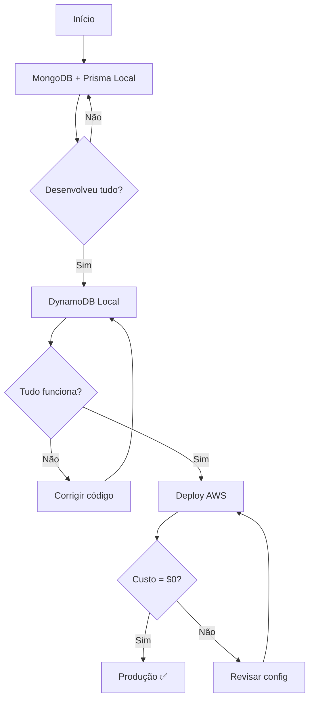

# 🔄 Workflow: Desenvolvimento Local → Deploy AWS

**Guia completo** para testar localmente e depois fazer deploy na AWS com **custo ZERO**.

---

## 🎯 **Visão Geral do Workflow**

```
1. 🏠 Desenvolvimento Local (MongoDB + Prisma)
          ↓
2. 🧪 Teste Local (DynamoDB Local)
          ↓
3. ☁️  Deploy AWS (DynamoDB AWS - Free Tier)
          ↓
4. 🎉 Produção (R$ 0,00/mês)
```

---

## 1️⃣ **FASE 1: Desenvolvimento Rápido (MongoDB + Prisma)**

### **Por que começar com MongoDB?**

- ✅ Mais rápido para desenvolver (Prisma ORM)
- ✅ Relacionamentos automáticos
- ✅ Migrations fáceis
- ✅ Type-safe completo
- ✅ Prisma Studio (GUI visual)

### **Configuração (.env)**

```bash
# Banco de dados
DATABASE_PROVIDER=PRISMA
DATABASE_URL="mongodb://localhost:27017/blog?replicaSet=rs0&directConnection=true"

# AWS (não usado ainda, mas pode deixar)
AWS_REGION=us-east-1
DYNAMODB_TABLE_PREFIX=blog
```

### **Setup**

```bash
# 1. Iniciar MongoDB
docker-compose up -d mongodb

# 2. Aguardar Replica Set (15s)
timeout /t 15

# 3. Gerar Prisma Client
npm run prisma:generate

# 4. Sincronizar schema
npm run prisma:push

# 5. Popular com dados
npm run seed

# 6. Rodar aplicação
npm run dev
```

### **Testar**

```bash
# Health check
curl http://localhost:4000/health \
  -H "X-Database-Provider: PRISMA"

# Deve retornar:
{
  "database": {
    "provider": "PRISMA",
    "description": "MongoDB + Prisma (Local)"
  }
}

# Listar posts
curl http://localhost:4000/posts \
  -H "X-Database-Provider: PRISMA"
```

### **Verificar Dados (GUI)**

```bash
npm run prisma:studio

# Abre http://localhost:5555
# Interface visual para ver/editar dados
```

---

## 2️⃣ **FASE 2: Teste com DynamoDB Local**

### **Por que testar com DynamoDB Local?**

- ✅ Simula AWS antes de fazer deploy
- ✅ Testa se código funciona com DynamoDB
- ✅ Identifica problemas antes da nuvem
- ✅ Grátis, sem custo AWS
- ✅ Offline

### **Configuração (.env)**

```bash
# Trocar para DynamoDB
DATABASE_PROVIDER=DYNAMODB

# MongoDB (manter para comparação)
DATABASE_URL="mongodb://localhost:27017/blog?replicaSet=rs0&directConnection=true"

# DynamoDB Local
DYNAMODB_ENDPOINT=http://localhost:8000  # ← Chave para detecção!
DYNAMODB_TABLE_PREFIX=blog
AWS_REGION=us-east-1
```

### **Setup**

```bash
# 1. Manter MongoDB rodando (para comparar)
# docker-compose up -d mongodb  # Já está rodando

# 2. Iniciar DynamoDB Local
docker-compose up -d dynamodb-local

# 3. Aguardar inicialização (5s)
timeout /t 5

# 4. Criar tabelas DynamoDB
npm run dynamodb:create-tables

# Saída esperada:
# 🗄️ CRIANDO TABELAS NO DYNAMODB LOCAL
# 💰 Billing Mode: Provisioned (FREE TIER PERMANENTE)
# ⚡ Capacidade Total: 25 RCU + 25 WCU
# ✅ 7 tabelas criadas!

# 5. Popular DynamoDB
npm run dynamodb:seed

# 6. Rodar aplicação (mesma porta!)
npm run dev
```

### **Testar com DynamoDB Local**

```bash
# Health check DynamoDB
curl http://localhost:4000/health \
  -H "X-Database-Provider: DYNAMODB"

# Deve retornar:
{
  "database": {
    "provider": "DYNAMODB",
    "description": "DynamoDB Local (Desenvolvimento)",
    "dynamodbEnvironment": "LOCAL"
  }
}

# Listar posts do DynamoDB
curl http://localhost:4000/posts \
  -H "X-Database-Provider: DYNAMODB"

# Comparar com Prisma
curl http://localhost:4000/posts \
  -H "X-Database-Provider: PRISMA"
```

### **Comparar Resultados**

```bash
# Mesma aplicação, 2 bancos diferentes!
# Alterne o header X-Database-Provider para comparar
```

---

## 3️⃣ **FASE 3: Deploy AWS (Produção - Free Tier)**

### **Por que fazer deploy?**

- ✅ Alta disponibilidade (SLA 99.99%)
- ✅ Escala automática
- ✅ Sem servidor para gerenciar
- ✅ **Custo ZERO** (Free Tier permanente)

### **Configuração (.env.production)**

```bash
# NÃO usar .env em produção!
# CloudFormation/SAM configura automaticamente

# Variáveis definidas no template.yaml:
# DATABASE_PROVIDER=DYNAMODB (automático)
# AWS_REGION=us-east-1 (automático)
# DYNAMODB_TABLE_PREFIX=blog-prod (automático)
# DYNAMODB_ENDPOINT=(vazio - usa AWS!) ← Chave!
```

### **Pré-requisitos**

```bash
# 1. AWS CLI configurado
aws configure

# Informar:
# - AWS Access Key ID
# - AWS Secret Access Key  
# - Region: us-east-1
# - Output: json

# 2. Verificar conta
aws sts get-caller-identity

# Deve retornar seu User ID

# 3. SAM CLI instalado
sam --version

# Deve retornar: SAM CLI, version 1.x.x
```

### **Deploy**

```bash
# 1. Build da aplicação
cd src/lambda
sam build

# Saída:
# Building codeuri: ../../
# Running NodejsNpmBuilder:NpmPack
# Build Succeeded

# 2. Deploy pela primeira vez (guided)
sam deploy --guided

# Responder:
# Stack Name: blog-backend-api
# AWS Region: us-east-1
# Parameter Environment: prod
# Confirm changes before deploy: Y
# Allow SAM CLI IAM role creation: Y
# Save arguments to configuration file: Y

# 3. Deploy futuro (automático)
sam deploy --config-env prod
```

### **O que é Criado na AWS**

```
Stack CloudFormation: blog-backend-api
├── 1× Lambda Function (Node.js 20)
│   ├── Memory: 512 MB
│   ├── Timeout: 30s
│   └── Function URL (endpoint HTTP)
│
├── 7× DynamoDB Tables (25 RCU/WCU total)
│   ├── blog-prod-users (5 RCU/WCU)
│   ├── blog-prod-posts (5 RCU/WCU)
│   ├── blog-prod-categories (3 RCU/WCU)
│   ├── blog-prod-comments (3 RCU/WCU)
│   ├── blog-prod-likes (3 RCU/WCU)
│   ├── blog-prod-bookmarks (3 RCU/WCU)
│   └── blog-prod-notifications (3 RCU/WCU)
│
├── 16× Global Secondary Indexes
│
├── 1× CloudWatch Log Group
│   └── Retenção: 30 dias
│
└── 1× IAM Role (para Lambda)

💰 Custo Total: R$ 0,00 (Free Tier permanente)
```

### **Obter URL da API**

```bash
# Ver outputs do CloudFormation
aws cloudformation describe-stacks \
  --stack-fullName blog-backend-api \
  --query 'Stacks[0].Outputs'

# Ou via SAM
sam list stack-outputs --stack-fullName blog-backend-api

# Copiar o BlogApiFunctionUrl
```

### **Testar na AWS**

```bash
# URL retornada pelo comando acima
export API_URL="https://xyz.lambda-url.us-east-1.on.aws"

# Health check
curl $API_URL/health

# Listar posts
curl $API_URL/posts

# Criar post (precisa auth Cognito)
curl -X POST $API_URL/posts \
  -H "Content-Type: application/json" \
  -H "Authorization: Bearer SEU_TOKEN_COGNITO" \
  -d '{
    "title": "Meu Post",
    "slug": "meu-post",
    "content": {...},
    "subcategoryId": "..."
  }'
```

---

## 🔄 **Comparação dos 3 Ambientes**

| Aspecto | MongoDB Local | DynamoDB Local | AWS DynamoDB |
|---------|---------------|----------------|--------------|
| **Banco** | MongoDB | DynamoDB | DynamoDB |
| **ORM** | Prisma | AWS SDK | AWS SDK |
| **Endpoint** | localhost:27017 | localhost:8000 | AWS Cloud |
| **Detecção** | `DATABASE_PROVIDER=PRISMA` | `DYNAMODB_ENDPOINT=...` | Sem `DYNAMODB_ENDPOINT` |
| **Setup** | Docker Compose | Docker Compose | CloudFormation |
| **Custo** | R$ 0 | R$ 0 | R$ 0 (Free Tier) |
| **Performance** | Boa | Boa | Excelente |
| **Escalabilidade** | Limitada | Limitada | Infinita |
| **Uso** | Desenvolvimento | Testes pré-deploy | Produção |

---

## 📋 **Checklist Completo**

### **Fase 1: Desenvolvimento Local** 🏠

- [ ] MongoDB rodando (`docker ps`)
- [ ] Prisma Client gerado (`npm run prisma:generate`)
- [ ] Schema sincronizado (`npm run prisma:push`)
- [ ] Dados populados (`npm run seed`)
- [ ] API rodando (`npm run dev`)
- [ ] Testes passando (`npm test`)
- [ ] Swagger funcionando (`http://localhost:4000/docs`)
- [ ] Todas as rotas testadas

### **Fase 2: Teste DynamoDB Local** 🧪

- [ ] DynamoDB Local rodando (`docker ps`)
- [ ] Tabelas criadas (`npm run dynamodb:create-tables`)
- [ ] Dados populados (`npm run dynamodb:seed`)
- [ ] API rodando (`npm run dev`)
- [ ] Header `X-Database-Provider: DYNAMODB` funciona
- [ ] Comparar resultados com MongoDB
- [ ] Performance aceitável
- [ ] Sem erros de throttling

### **Fase 3: Deploy AWS** ☁️

- [ ] AWS CLI configurado (`aws configure`)
- [ ] SAM CLI instalado (`sam --version`)
- [ ] Build bem-sucedido (`sam build`)
- [ ] Deploy bem-sucedido (`sam deploy`)
- [ ] 7 tabelas criadas na AWS
- [ ] Lambda Function URL obtida
- [ ] Health check funcionando
- [ ] Cognito configurado
- [ ] Custo = $0.00 (`aws ce get-cost-and-usage`)

---

## 🛠️ **Scripts Úteis**

### **Alternar entre Bancos Localmente**

```bash
# Script já existe!
.\scripts\alternar-banco.bat

# Ou manual:
# Para MongoDB
echo DATABASE_PROVIDER=PRISMA > .env

# Para DynamoDB Local
echo DATABASE_PROVIDER=DYNAMODB >> .env
echo DYNAMODB_ENDPOINT=http://localhost:8000 >> .env
```

### **Comparar Dados**

```bash
# MongoDB
curl http://localhost:4000/users \
  -H "X-Database-Provider: PRISMA" \
  | jq length

# DynamoDB Local
curl http://localhost:4000/users \
  -H "X-Database-Provider: DYNAMODB" \
  | jq length

# Devem retornar o mesmo número!
```

### **Limpar Tudo e Recomeçar**

```bash
# Limpar MongoDB
npm run prisma:push --force-reset

# Limpar DynamoDB Local
docker restart blogapi-dynamodb
npm run dynamodb:create-tables
npm run dynamodb:seed
```

---

## 🚀 **Migração Completa: Local → AWS**

### **Passo a Passo Detalhado**

#### **Semana 1-2: Desenvolvimento**

```bash
# Use MongoDB + Prisma
DATABASE_PROVIDER=PRISMA

# Desenvolva todas as features
# Teste unitário + integração
# Valide no Swagger
```

#### **Semana 3: Preparação**

```bash
# 1. Teste com DynamoDB Local
DATABASE_PROVIDER=DYNAMODB
DYNAMODB_ENDPOINT=http://localhost:8000

# 2. Criar tabelas
npm run dynamodb:create-tables

# 3. Popular dados
npm run dynamodb:seed

# 4. Testar TODAS as rotas
# Use header: X-Database-Provider: DYNAMODB

# 5. Validar que funciona igual ao Prisma
```

#### **Semana 4: Deploy**

```bash
# 1. Configurar AWS
aws configure

# 2. Build
cd src/lambda
sam build

# 3. Deploy
sam deploy --guided

# 4. Obter URL
sam list stack-outputs

# 5. Testar
curl https://sua-url.lambda-url.us-east-1.on.aws/health

# 6. Configurar Cognito (se ainda não tiver)
# Ver: docs/03-GUIAS/GUIA_INTEGRACAO_AUTH.md

# 7. Monitorar custos
aws ce get-cost-and-usage --time-period Start=2025-10-01,End=2025-10-31 --granularity MONTHLY --metrics BlendedCost

# Deve mostrar: $0.00 ✅
```

---

## 🎯 **Validação de Compatibilidade**

### **Antes de Fazer Deploy**

Garanta que **TODAS** as rotas funcionam localmente com DynamoDB:

```bash
# Use o script de teste de rotas!
.\scripts\testar-todas-rotas.ps1

# Ou teste manual cada categoria:

# Health
curl http://localhost:4000/health -H "X-Database-Provider: DYNAMODB"

# Usuários
curl http://localhost:4000/users -H "X-Database-Provider: DYNAMODB"

# Posts
curl http://localhost:4000/posts -H "X-Database-Provider: DYNAMODB"

# Categorias
curl http://localhost:4000/categories -H "X-Database-Provider: DYNAMODB"

# Comentários (por post)
curl http://localhost:4000/comments/post/{postId} -H "X-Database-Provider: DYNAMODB"

# Likes (por post)
curl http://localhost:4000/likes/post/{postId} -H "X-Database-Provider: DYNAMODB"

# Bookmarks (por usuário)
curl http://localhost:4000/bookmarks/user/{userId} -H "X-Database-Provider: DYNAMODB"

# Notificações (por usuário)
curl http://localhost:4000/notifications/user/{userId} -H "X-Database-Provider: DYNAMODB"
```

**Todas devem funcionar!** ✅

---

## 💰 **Monitoramento de Custos**

### **Durante Desenvolvimento Local**

```
MongoDB: R$ 0,00 (Docker local)
DynamoDB Local: R$ 0,00 (Docker local)
Custo total: R$ 0,00 ✅
```

### **Após Deploy AWS**

```bash
# Verificar a cada semana
aws ce get-cost-and-usage \
  --time-period Start=$(date -d '7 days ago' +%Y-%m-%d),End=$(date +%Y-%m-%d) \
  --granularity DAILY \
  --metrics BlendedCost \
  --group-by Type=SERVICE

# Configurar alarme de custo
aws budgets create-budget \
  --account-id $(aws sts get-caller-identity --query Account --output text) \
  --budget '{
    "BudgetName": "blog-api-budget",
    "BudgetLimit": {
      "Amount": "1",
      "Unit": "USD"
    },
    "TimeUnit": "MONTHLY",
    "BudgetType": "COST"
  }' \
  --notifications-with-subscribers '[{
    "Notification": {
      "NotificationType": "ACTUAL",
      "ComparisonOperator": "GREATER_THAN",
      "Threshold": 0.5
    },
    "Subscribers": [{
      "SubscriptionType": "EMAIL",
      "Address": "seu-email@example.com"
    }]
  }]'
```

---

## 🔧 **Troubleshooting**

### **Problema: API funciona com PRISMA mas falha com DYNAMODB**

**Causa**: Dados não foram populados ou tabelas não foram criadas.

**Solução**:

```bash
# Verificar se DynamoDB Local está rodando
docker ps | grep dynamodb

# Recriar tabelas
docker restart blogapi-dynamodb
npm run dynamodb:create-tables
npm run dynamodb:seed

# Testar novamente
curl http://localhost:4000/health -H "X-Database-Provider: DYNAMODB"
```

### **Problema: Deploy AWS retorna erro de permissão**

**Causa**: IAM não tem permissões suficientes.

**Solução**:

```bash
# Verificar permissões
aws iam get-user

# Adicionar política de CloudFormation
aws iam attach-user-policy \
  --user-fullName seu-usuario \
  --policy-arn arn:aws:iam::aws:policy/AWSCloudFormationFullAccess
```

### **Problema: Custo > $0.00 após deploy**

**Causa**: Algo saiu do Free Tier.

**Solução**:

```bash
# Verificar qual serviço está cobrando
aws ce get-cost-and-usage \
  --time-period Start=2025-10-01,End=2025-10-31 \
  --granularity MONTHLY \
  --metrics BlendedCost \
  --group-by Type=SERVICE

# Verificar se tabelas estão Provisioned
aws dynamodb describe-table --table-fullName blog-prod-users

# BillingModeSummary deve mostrar: PROVISIONED
```

---

## 📊 **Resumo do Workflow**



---

## ✅ **Checklist Final Antes de Produção**

### **Código**

- [ ] Todas rotas testadas (59 rotas)
- [ ] Funciona com PRISMA local
- [ ] Funciona com DYNAMODB local
- [ ] Testes unitários passando (>95% coverage)
- [ ] Testes E2E passando
- [ ] Sem warnings no console

### **Segurança**

- [ ] Cognito configurado
- [ ] JWT validado
- [ ] CORS configurado
- [ ] Rate limiting (se necessário)
- [ ] Validação de inputs (Zod)

### **Performance**

- [ ] Itens DynamoDB ≤ 1 KB
- [ ] Índices GSI corretos
- [ ] Cache configurado (se aplicável)
- [ ] Logs otimizados

### **AWS**

- [ ] Free Tier ativo
- [ ] CloudWatch Alarms configurados
- [ ] Backup configurado (PITR)
- [ ] Monitoramento de custos ativo
- [ ] Budget alert configurado

---

## 🎉 **Pronto!**

Agora você tem:

✅ Ambiente de **desenvolvimento local** rápido (MongoDB)  
✅ Ambiente de **teste local** que simula AWS (DynamoDB Local)  
✅ **Deploy AWS** otimizado para Free Tier  
✅ **Custo ZERO** permanente  
✅ **Alta disponibilidade** e escalabilidade  

**Comece desenvolvendo local, teste com DynamoDB Local, e faça deploy quando estiver pronto!** 🚀

---

**Criado em**: 17/10/2025  
**Status**: ✅ **Workflow Completo Validado**
