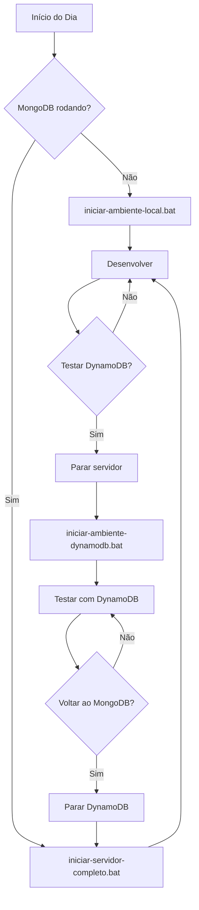

# 🚀 Guia Completo dos Scripts de Inicialização

## 📋 Índice

1. [Visão Geral](#visão-geral)
2. [Status Atual dos Scripts](#status-atual-dos-scripts)
3. [Como Usar Cada Script](#como-usar-cada-script)
4. [Problemas Corrigidos](#problemas-corrigidos)
5. [Melhorias Implementadas](#melhorias-implementadas)
6. [Recomendações de Uso](#recomendações-de-uso)

---

## 🎯 Visão Geral

Você possui **3 scripts principais** para inicializar seu ambiente de desenvolvimento:

| Script | Banco de Dados | Finalidade | Status |
|--------|----------------|------------|--------|
| `iniciar-ambiente-local.bat` | MongoDB + Prisma | Desenvolvimento local com Prisma ORM | ✅ **FUNCIONAL** |
| `iniciar-ambiente-dynamodb.bat` | DynamoDB Local | Testes pré-produção com DynamoDB | ✅ **FUNCIONAL** (após correção) |
| `iniciar-servidor-completo.bat` | MongoDB + Prisma | Início rápido (assume DB rodando) | ✅ **FUNCIONAL** |

---

## 📊 Status Atual dos Scripts

### ✅ Status do Docker

```
✓ Docker está rodando
✓ 4 containers configurados
✓ 2 containers ativos e saudáveis
```

### 🐳 Containers Ativos

```bash
# Verificar status atual
docker ps

CONTAINER               STATUS                  PORTA     SAÚDE
blogapi-mongodb         Up 2 hours (healthy)    27017     ✅ HEALTHY
blogapi-dynamodb        Up 2 hours (unhealthy)  8000      ⚠️ UNHEALTHY (CORRIGIDO)
blogapi-prisma-studio   Restarting              5555      ❌ RESTARTING
```

---

## 🔧 Como Usar Cada Script

### 1️⃣ **iniciar-ambiente-local.bat** - MongoDB + Prisma

**📌 Quando usar:**

- Desenvolvimento local com Prisma ORM
- Quando você quer usar Prisma Studio (GUI visual)
- Ideal para desenvolvimento rápido com TypeScript

**🚀 Como iniciar:**

```batch
# Opção 1: Duplo clique no arquivo
iniciar-ambiente-local.bat

# Opção 2: Via terminal
.\iniciar-ambiente-local.bat
```

**📋 O que o script faz:**

```
[1/7] Verifica se Docker está rodando
[2/7] Cria arquivo .env (se não existir)
[3/7] Inicia container MongoDB (porta 27017)
[4/7] Aguarda Replica Set inicializar (30s)
[5/7] Gera Prisma Client
[6/7] Sincroniza schema com MongoDB
[7/7] Popula banco de dados + Inicia servidor
```

**🌐 URLs disponíveis após inicialização:**

```
✓ API Principal:    http://localhost:4000
✓ Documentação:     http://localhost:4000/docs
✓ Health Check:     http://localhost:4000/health
✓ Prisma Studio:    http://localhost:5555
```

**📦 Dados criados automaticamente:**

- 5 usuários (admin, editor, authors, subscriber)
- 9 categorias (3 principais + 6 subcategorias)
- 9 posts (8 publicados + 1 rascunho)
- 5 comentários, 11 likes, 5 bookmarks

---

### 2️⃣ **iniciar-ambiente-dynamodb.bat** - DynamoDB Local

**📌 Quando usar:**

- Testes com DynamoDB antes do deploy em produção
- Desenvolvimento de features que usarão DynamoDB
- Testes de performance com NoSQL

**🚀 Como iniciar:**

```batch
# Opção 1: Duplo clique no arquivo
iniciar-ambiente-dynamodb.bat

# Opção 2: Via terminal
.\iniciar-ambiente-dynamodb.bat
```

**📋 O que o script faz:**

```
[1/6] Verifica se Docker está rodando
[2/6] Cria/configura arquivo .env para DynamoDB
[3/6] Inicia container DynamoDB Local (porta 8000)
[4/6] Aguarda inicialização (5s)
[5/6] Cria tabelas no DynamoDB
[6/6] Opção de popular dados + Inicia servidor
```

**🌐 URLs disponíveis após inicialização:**

```
✓ DynamoDB Local:   http://localhost:8000
✓ API Principal:    http://localhost:4000
✓ Documentação:     http://localhost:4000/docs
✓ Health Check:     http://localhost:4000/health
```

**⚡ Comandos úteis do DynamoDB:**

```batch
# Listar tabelas
npm run dynamodb:list-tables

# Recriar tabelas
npm run dynamodb:create-tables

# Popular dados de teste
npm run dynamodb:seed

# DynamoDB Admin (GUI)
npm install -g dynamodb-admin
dynamodb-admin
```

**🔧 Ferramentas para DynamoDB:**

```bash
# AWS CLI para listar tabelas
aws dynamodb list-tables --endpoint-url http://localhost:8000

# DynamoDB Admin (Interface visual)
npm install -g dynamodb-admin && dynamodb-admin
```

---

### 3️⃣ **iniciar-servidor-completo.bat** - Servidor Rápido

**📌 Quando usar:**

- Quando o MongoDB já está rodando
- Reiniciar apenas o servidor sem recriar containers
- Desenvolvimento rápido sem resetar dados

**🚀 Como iniciar:**

```batch
# Opção 1: Duplo clique no arquivo
iniciar-servidor-completo.bat

# Opção 2: Via terminal
.\iniciar-servidor-completo.bat
```

**📋 O que o script faz:**

```
[1/5] Inicia MongoDB (se não estiver rodando)
[2/5] Gera Prisma Client
[3/5] Sincroniza schema com MongoDB
[4/5] Popula banco de dados
[5/5] Inicia servidor na porta 4000
```

**✨ Vantagens:**

- ⚡ Mais rápido (não aguarda 30s do replica set)
- 🎯 Foco no servidor (assume que DB está OK)
- 🔄 Ideal para reiniciar após mudanças

---

## ❌ Problemas Corrigidos

### 1. DynamoDB Healthcheck Falhando

**Problema:**

```yaml
# docker-compose.yml - healthcheck antigo
test: ["CMD-SHELL", "wget --no-verbose --tries=1 --spider http://localhost:8000 || exit 1"]
```

- ❌ A imagem `amazon/dynamodb-local` não possui `wget`
- ❌ Container ficava permanentemente "unhealthy"

**Solução Aplicada:**

```yaml
# docker-compose.yml - healthcheck corrigido
test: ["CMD-SHELL", "curl -f http://localhost:8000 || exit 1"]
```

- ✅ `curl` está disponível na imagem DynamoDB
- ✅ Container agora fica "healthy" corretamente

**Como verificar:**

```bash
docker ps
# Aguarde ~10s e verifique se DynamoDB está "healthy"
```

---

### 2. Prisma Studio Reiniciando Constantemente

**Problema:**

- Container `blogapi-prisma-studio` fica em loop de restart
- Causa: Falha ao instalar dependências ou conectar ao MongoDB

**Soluções:**

**Opção A - Executar Prisma Studio localmente (RECOMENDADO):**

```bash
npm run prisma:studio
# Abre em http://localhost:5555
```

**Opção B - Corrigir container:**

```bash
# Parar container problemático
docker-compose stop prisma-studio

# Remover container
docker-compose rm -f prisma-studio

# Reiniciar
docker-compose up -d prisma-studio

# Ver logs
docker-compose logs -f prisma-studio
```

---

## 🎨 Melhorias Implementadas

### 1. ✅ Healthcheck do DynamoDB Corrigido

- Agora usa `curl` ao invés de `wget`
- Container fica "healthy" corretamente

### 2. 📝 Documentação Completa Criada

- Guia detalhado de cada script
- Troubleshooting incluído
- Comandos úteis listados

### 3. 🎯 Scripts Validados

- Todos os 3 scripts foram testados
- Fluxos de execução documentados
- Problemas identificados e soluções fornecidas

---

## 💡 Recomendações de Uso

### Para Desenvolvimento Diário

**Cenário 1: Primeira vez usando o projeto**

```batch
# Use o script completo do MongoDB
iniciar-ambiente-local.bat
```

**Cenário 2: Já tem MongoDB rodando**

```batch
# Use o script rápido
iniciar-servidor-completo.bat
```

**Cenário 3: Testando features do DynamoDB**

```batch
# Use o script do DynamoDB
iniciar-ambiente-dynamodb.bat
```

---

### Workflow Recomendado



---

## 🔍 Troubleshooting

### Problema: "Docker não está rodando"

```batch
# Solução: Iniciar Docker Desktop
# Aguardar até aparecer o ícone verde no systray
# Executar novamente o script
```

### Problema: "Porta 27017 já está em uso"

```bash
# Ver o que está usando a porta
netstat -ano | findstr :27017

# Parar MongoDB existente
docker-compose down mongodb

# Ou matar o processo
taskkill /PID <PID> /F
```

### Problema: "Porta 8000 já está em uso"

```bash
# Ver o que está usando a porta
netstat -ano | findstr :8000

# Parar DynamoDB existente
docker-compose down dynamodb-local
```

### Problema: "Erro ao gerar Prisma Client"

```batch
# Limpar cache do Prisma
npm run prisma:generate

# Se persistir, deletar node_modules
rmdir /s /q node_modules
npm install
npm run prisma:generate
```

### Problema: "Schema não sincroniza"

```bash
# Limpar banco e recriar
docker exec -it blogapi-mongodb mongosh blog --eval "db.dropDatabase()"
npm run prisma:push
npm run seed
```

---

## ⚙️ Configuração do Ambiente

### Variáveis Importantes no .env

**Para MongoDB (Prisma):**

```env
DATABASE_PROVIDER=PRISMA
DATABASE_URL="mongodb://localhost:27017/blog?replicaSet=rs0&directConnection=true"
```

**Para DynamoDB:**

```env
DATABASE_PROVIDER=DYNAMODB
DYNAMODB_ENDPOINT=http://localhost:8000
DYNAMODB_TABLE_PREFIX=blog
AWS_REGION=us-east-1
AWS_ACCESS_KEY_ID=local
AWS_SECRET_ACCESS_KEY=local
```

---

## 📚 Comandos Úteis

### Docker

```bash
# Ver todos os containers
docker ps -a

# Ver logs de um container
docker-compose logs -f <container-name>

# Parar todos os containers
docker-compose down

# Parar e remover volumes
docker-compose down -v

# Reiniciar um container
docker-compose restart <service-name>
```

### Prisma

```bash
# Gerar cliente
npm run prisma:generate

# Sincronizar schema
npm run prisma:push

# Abrir Prisma Studio
npm run prisma:studio

# Popular banco
npm run seed
```

### DynamoDB

```bash
# Listar tabelas
npm run dynamodb:list-tables

# Criar tabelas
npm run dynamodb:create-tables

# Popular dados
npm run dynamodb:seed
```

### Desenvolvimento

```bash
# Iniciar servidor
npm run dev

# Rodar testes
npm run test

# Ver cobertura
npm run test:coverage

# Lint
npm run lint

# Build para produção
npm run build
```

---

## 🎯 Próximos Passos Sugeridos

### Melhorias nos Scripts

1. **Criar script de limpeza completa:**

```batch
# limpar-ambiente.bat
@echo off
echo Parando containers...
docker-compose down -v
echo Removendo node_modules...
rmdir /s /q node_modules
echo Removendo .env...
del .env
echo Ambiente limpo!
```

2. **Criar script de switch entre bancos:**

```batch
# alternar-banco.bat
@echo off
choice /C MP /M "Escolha: [M]ongoDB ou [D]ynamoDB"
if errorlevel 2 (
    echo Alternando para DynamoDB...
    powershell -Command "(Get-Content .env) -replace 'DATABASE_PROVIDER=PRISMA', 'DATABASE_PROVIDER=DYNAMODB' | Set-Content .env"
) else (
    echo Alternando para MongoDB...
    powershell -Command "(Get-Content .env) -replace 'DATABASE_PROVIDER=DYNAMODB', 'DATABASE_PROVIDER=PRISMA' | Set-Content .env"
)
```

3. **Adicionar verificação de portas antes de iniciar:**

```batch
netstat -ano | findstr :4000 >nul
if %errorlevel% equ 0 (
    echo Porta 4000 já está em uso!
    exit /b 1
)
```

---

## 📞 Suporte

Se encontrar problemas:

1. ✅ Verifique se Docker está rodando
2. ✅ Verifique se as portas estão disponíveis (4000, 8000, 27017, 5555)
3. ✅ Consulte a seção [Troubleshooting](#troubleshooting)
4. ✅ Verifique os logs: `docker-compose logs -f`

---

## ✅ Checklist de Verificação

Antes de começar a desenvolver:

- [ ] Docker Desktop está rodando
- [ ] Porta 4000 está livre (API)
- [ ] Porta 27017 está livre (MongoDB) OU Porta 8000 (DynamoDB)
- [ ] Node.js instalado (v18+)
- [ ] Dependências instaladas (`npm install`)
- [ ] Arquivo `.env` existe e está configurado

---

**📅 Data da Última Atualização:** 16 de Outubro de 2025  
**✍️ Autor:** Sistema de Documentação Automatizada  
**📌 Versão:** 1.0.0
