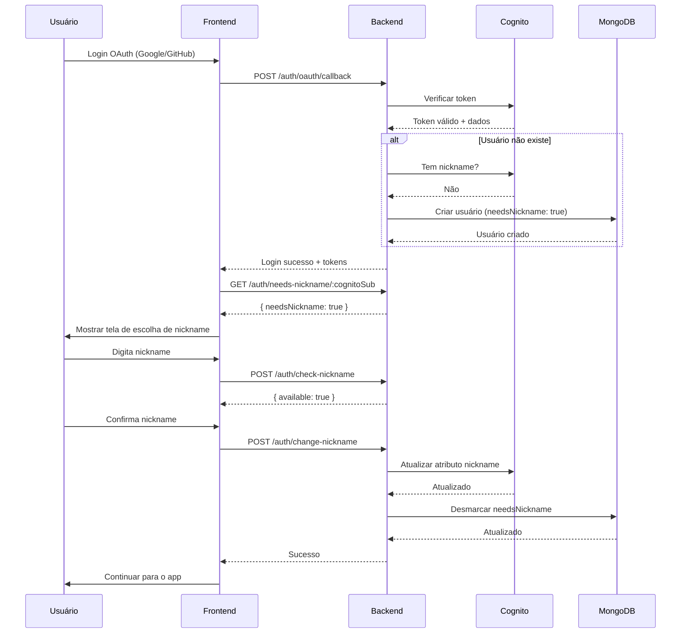

# Fluxo de Escolha de Nickname para Usuários OAuth

## 📋 Visão Geral

Este documento descreve o fluxo implementado para solicitar que usuários autenticados via OAuth (Google/GitHub) escolham um nickname na primeira vez que fazem login, caso não tenham um nickname no Cognito.

**✨ Abordagem Simplificada:** Esta solução **NÃO modifica o banco de dados** existente. Apenas verifica o Cognito em tempo real e retorna a flag `needsNickname` na resposta do login OAuth.

## 🎯 Objetivo

Quando um usuário faz login pela primeira vez usando Google ou GitHub, o Cognito pode não fornecer um nickname. Este fluxo garante que todos os usuários tenham um nickname único escolhido por eles, sem alterar o schema do banco de dados em produção.

## 🔄 Fluxo Completo

### 1. Registro/Login OAuth (Backend)

Quando um usuário faz login via OAuth (Google/GitHub), o backend:

1. **Verifica se o usuário já existe no MongoDB**
   - Se não existir, cria um novo usuário (dados básicos apenas)

2. **Verifica se tem nickname no Cognito**
   - Consulta o Cognito para verificar se o atributo `nickname` existe
   - Se **NÃO tem nickname**: define `needsNickname: true` na resposta
   - Se **tem nickname**: define `needsNickname: false` na resposta

3. **Retorna a resposta do login incluindo a flag `needsNickname`**

```typescript
// Código simplificado do fluxo OAuth
let user = await this.usersService.getUserByCognitoSub(payload.sub);

if (!user) {
  // Criar usuário apenas com dados básicos (SEM flag needsNickname no banco)
  await this.usersService.createUser({
    cognitoSub: payload.sub,
    fullName: payload.name || 'Usuário',
    email: payload.email,
  });
  user = await this.usersService.getUserByCognitoSub(payload.sub);
}

// Verificar se tem nickname no Cognito (APENAS consulta, não grava)
const hasNickname = await checkCognitoNickname(payload.sub);

// Retornar resposta incluindo flag needsNickname
return {
  tokens: { ... },
  user: {
    ...user,
    needsNickname: !hasNickname // Calculado em tempo real
  }
};
```

### 2. Verificação no Frontend

Após o login OAuth bem-sucedido, o frontend recebe a resposta:

```typescript
// Resposta do login OAuth
{
  "success": true,
  "data": {
    "tokens": { ... },
    "user": {
      "id": "...",
      "cognitoSub": "abc-123",
      "fullName": "João Silva",
      "email": "joao@gmail.com",
      "needsNickname": true,  // ← FLAG calculada em tempo real
      ...
    }
  }
}
```

**O frontend deve:**

1. **Verificar o campo `needsNickname` na resposta do login**
   - Se `needsNickname: true` → Mostrar tela de escolha
   - Se `needsNickname: false` → Continuar normalmente

2. **Alternativamente, pode consultar o endpoint:**
   ```typescript
   GET /auth/needs-nickname/:cognitoSub
   
   Response:
   {
     "success": true,
     "data": {
       "needsNickname": true,    // true se precisa escolher
       "hasNickname": false,     // false se não tem no Cognito
       "cognitoSub": "abc-123"
     }
   }
   ```

3. **Se `needsNickname: true`:**
   - Mostrar tela modal ou página solicitando escolha de nickname
   - Validar disponibilidade do nickname antes de submeter
   - Enviar novo nickname para o backend

### 3. Escolha do Nickname (Frontend)

O frontend deve implementar uma tela com:

- **Campo de input** para o nickname
- **Validação em tempo real:**
  - Mínimo 3 caracteres
  - Máximo 30 caracteres
  - Apenas letras e números (sem @, sem caracteres especiais)
  - Verificar disponibilidade via endpoint

```typescript
// Verificar disponibilidade
POST /auth/check-nickname
Body: { 
  "nickname": "meunick",
  "excludeCognitoSub": "abc-123" // opcional
}

Response:
{
  "success": true,
  "data": {
    "available": true,
    "message": "Este nickname está disponível",
    "nickname": "meunick"
  }
}
```

### 4. Submissão do Nickname

Quando o usuário escolher um nickname válido:

```typescript
POST /auth/change-nickname
Body: {
  "cognitoSub": "abc-123-xyz",
  "newNickname": "meunick"
}

Response:
{
  "success": true,
  "message": "Nickname atualizado com sucesso!"
}
```

**O que acontece no backend:**
1. Valida o nickname (formato, disponibilidade)
2. Atualiza o atributo `nickname` no Cognito
3. Retorna sucesso

### 5. Após Escolha

Depois que o usuário escolhe o nickname:
- O nickname fica armazenado **apenas no Cognito**
- Nas próximas chamadas à API, o nickname virá do Cognito automaticamente
- Na próxima verificação, `needsNickname` será `false` (pois agora tem nickname no Cognito)
- O usuário não precisa escolher novamente

**🎯 Vantagens desta abordagem:**
- ✅ **Zero modificações no banco de dados** em produção
- ✅ Fonte única de verdade: Cognito
- ✅ Verificação em tempo real
- ✅ Sem sincronização de flags entre sistemas
- ✅ Mais simples e menos propensa a erros

## 📍 Endpoints Disponíveis

### 1. Verificar se Precisa Escolher Nickname

```http
GET /auth/needs-nickname/:cognitoSub
```

**Resposta:**
```json
{
  "success": true,
  "data": {
    "needsNickname": true,
    "hasNickname": false,
    "cognitoSub": "abc-123-xyz"
  }
}
```

### 2. Verificar Disponibilidade de Nickname

```http
POST /auth/check-nickname
Content-Type: application/json

{
  "nickname": "meunick",
  "excludeCognitoSub": "abc-123" // opcional, para edição
}
```

**Resposta:**
```json
{
  "success": true,
  "data": {
    "available": true,
    "message": "Este nickname está disponível",
    "nickname": "meunick"
  }
}
```

### 3. Alterar/Escolher Nickname

```http
POST /auth/change-nickname
Content-Type: application/json

{
  "cognitoSub": "abc-123-xyz",
  "newNickname": "meunick"
}
```

**Resposta:**
```json
{
  "success": true,
  "message": "Nickname atualizado com sucesso!"
}
```

## 🎨 Exemplo de Implementação Frontend (React)

```typescript
// Hook para verificar necessidade de nickname
function useNicknameCheck(cognitoSub: string) {
  const [needsNickname, setNeedsNickname] = useState(false);
  const [loading, setLoading] = useState(true);

  useEffect(() => {
    async function checkNickname() {
      try {
        const response = await api.get(`/auth/needs-nickname/${cognitoSub}`);
        setNeedsNickname(response.data.data.needsNickname);
      } catch (error) {
        console.error('Erro ao verificar nickname:', error);
      } finally {
        setLoading(false);
      }
    }

    if (cognitoSub) {
      checkNickname();
    }
  }, [cognitoSub]);

  return { needsNickname, loading };
}

// Componente de escolha de nickname
function NicknameChoiceModal({ cognitoSub, onComplete }) {
  const [nickname, setNickname] = useState('');
  const [available, setAvailable] = useState<boolean | null>(null);
  const [loading, setLoading] = useState(false);

  // Debounce para verificar disponibilidade
  useEffect(() => {
    const timer = setTimeout(async () => {
      if (nickname.length >= 3) {
        const response = await api.post('/auth/check-nickname', {
          nickname,
          excludeCognitoSub: cognitoSub
        });
        setAvailable(response.data.data.available);
      }
    }, 500);

    return () => clearTimeout(timer);
  }, [nickname, cognitoSub]);

  const handleSubmit = async () => {
    if (!available || nickname.length < 3) return;

    setLoading(true);
    try {
      await api.post('/auth/change-nickname', {
        cognitoSub,
        newNickname: nickname
      });
      onComplete();
    } catch (error) {
      console.error('Erro ao salvar nickname:', error);
    } finally {
      setLoading(false);
    }
  };

  return (
    <Modal>
      <h2>Escolha seu Nickname</h2>
      <p>Para continuar, por favor escolha um nickname único:</p>
      
      <Input
        value={nickname}
        onChange={(e) => setNickname(e.target.value)}
        placeholder="meunick"
        minLength={3}
        maxLength={30}
        pattern="[a-zA-Z0-9]+"
      />
      
      {nickname.length >= 3 && (
        <Status available={available}>
          {available === null && 'Verificando...'}
          {available === true && '✓ Disponível'}
          {available === false && '✗ Já está em uso'}
        </Status>
      )}
      
      <Button 
        onClick={handleSubmit}
        disabled={!available || loading}
      >
        {loading ? 'Salvando...' : 'Continuar'}
      </Button>
    </Modal>
  );
}

// Uso no App
function App() {
  const { user } = useAuth();
  const { needsNickname, loading } = useNicknameCheck(user?.cognitoSub);
  const [showNicknameModal, setShowNicknameModal] = useState(false);

  useEffect(() => {
    if (!loading && needsNickname) {
      setShowNicknameModal(true);
    }
  }, [loading, needsNickname]);

  return (
    <>
      {showNicknameModal && (
        <NicknameChoiceModal
          cognitoSub={user.cognitoSub}
          onComplete={() => setShowNicknameModal(false)}
        />
      )}
      {/* Resto do app */}
    </>
  );
}
```

## 📊 Diagrama de Fluxo



## 🔒 Regras de Validação

### Nickname
- ✅ **Mínimo:** 3 caracteres
- ✅ **Máximo:** 30 caracteres
- ✅ **Formato:** Apenas letras e números (a-zA-Z0-9)
- ❌ **Proibido:** @, espaços, caracteres especiais, underscore
- ✅ **Único:** Verificado no Cognito

### Comportamento
- **Usuários OAuth sem nickname:** Solicitado na primeira vez
- **Usuários OAuth com nickname:** Não solicitado
- **Usuários email direto:** Não solicitado (já escolheram na criação)
- **Após escolha:** Nickname salvo no Cognito, verificação retorna `needsNickname: false`

## 🗄️ Estrutura de Dados

### MongoDB (User)
```typescript
{
  cognitoSub: "abc-123-xyz",      // ID do Cognito
  fullName: "João Silva",          // Nome completo
  // ❌ NÃO TEM needsNickname aqui (verificado em tempo real no Cognito)
  role: "AUTHOR",
  isActive: true,
  isBanned: false,
  postsCount: 0,
  commentsCount: 0,
  createdAt: "2025-01-15T10:00:00Z",
  updatedAt: null
}
```

### Cognito (Atributos)
```json
{
  "sub": "abc-123-xyz",
  "email": "joao@gmail.com",
  "email_verified": true,
  "name": "João Silva",
  "nickname": "joaosilva123",      // Armazenado APENAS no Cognito
  "identities": [
    {
      "providerName": "Google",
      "userId": "..."
    }
  ]
}
```

## ⚠️ Observações Importantes

1. **Nickname APENAS no Cognito:**
   - O campo `nickname` é armazenado **apenas** no AWS Cognito
   - Não existe campo `nickname` no schema do Prisma/MongoDB
   - Quando necessário, o nickname é buscado do Cognito em tempo real

2. **Flag needsNickname - Calculada em Tempo Real:**
   - ✅ **NÃO é armazenada no banco de dados**
   - ✅ Calculada em tempo real consultando o Cognito
   - ✅ Retornada na resposta do login OAuth
   - ✅ Pode ser consultada via endpoint GET /auth/needs-nickname/:cognitoSub
   - ✅ Após salvar nickname no Cognito, próxima verificação retorna `false`

3. **Usuários Email Direto:**
   - Não precisam escolher nickname posteriormente
   - Já escolhem durante o registro (campo opcional)

4. **Banco de Dados:**
   - ✅ **Zero modificações necessárias no schema**
   - ✅ Funciona com banco em produção sem migração
   - ✅ Não precisa adicionar campo `needsNickname`
   - ✅ Fonte única de verdade: AWS Cognito

## 🧪 Testes

### Cenários de Teste

1. **Login OAuth primeira vez SEM nickname:**
   - ✅ Resposta contém `needsNickname: true`
   - ✅ Tela de escolha mostrada no frontend
   - ✅ Nickname salvo no Cognito
   - ✅ Próxima verificação retorna `needsNickname: false`

2. **Login OAuth primeira vez COM nickname:**
   - ✅ Resposta contém `needsNickname: false`
   - ✅ Tela de escolha NÃO mostrada
   - ✅ Nickname já disponível do Cognito

3. **Login OAuth segunda vez (já escolheu):**
   - ✅ Resposta contém `needsNickname: false`
   - ✅ Tela de escolha NÃO mostrada
   - ✅ Nickname buscado do Cognito

4. **Registro via Email:**
   - ✅ Não passa pelo fluxo OAuth
   - ✅ Tela de escolha NÃO necessária
   - ✅ Pode escolher nickname opcionalmente durante registro

## 📝 Logs Relevantes

O sistema registra logs importantes durante o fluxo:

```log
[AuthService] Verificando nickname no OAuth para usuário abc-123
[AuthService] Nickname encontrado no Cognito: joaosilva
[AuthService] Nickname atualizado com sucesso para usuário joao_silva
```

## 🔄 Atualização do Schema

### ✅ Nenhuma Atualização Necessária!

Esta solução **NÃO requer modificações no schema** do banco de dados:

- ❌ **Não precisa** adicionar campo `needsNickname` no Prisma
- ❌ **Não precisa** rodar migrations
- ❌ **Não precisa** atualizar banco de dados em produção
- ✅ **Funciona imediatamente** com banco existente
- ✅ **Zero downtime** na implementação

```prisma
model User {
  // Schema permanece EXATAMENTE como está
  // Nenhuma modificação necessária!
  
  cognitoSub String @id @map("_id")
  fullName String @unique
  avatar String?
  bio String?
  // ... resto dos campos normalmente
}
```

## 🚀 Deploy

Certifique-se de:
1. ✅ **Nenhuma migração de banco necessária!** 🎉
2. ✅ Testar os endpoints em desenvolvimento
3. ✅ Documentar no Swagger (já feito automaticamente)
4. ✅ Validar fluxo completo antes de ir para produção
5. ✅ Deploy pode ser feito sem downtime (não altera banco)

---

**Última atualização:** 2025-11-06  
**Versão:** 1.0.0  
**Autor:** Sistema de Autenticação - Rainer Portfolio Backend

