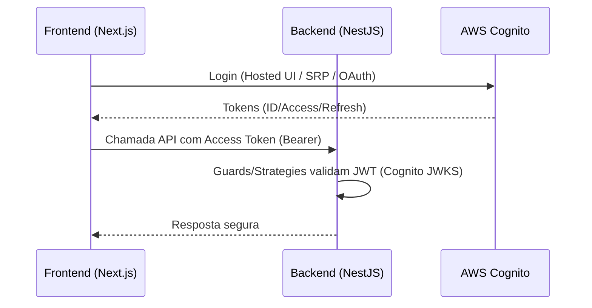

# Arquitetura — Backend (NestJS)

Este documento apresenta uma visão de alto nível da arquitetura do backend usando Mermaid.

```mermaid
flowchart LR
  subgraph Client
    Web[SPA/Next.js Frontend]
  end

  Web -->|REST/HTTPS| API[NestJS API Gateway]

  subgraph NestJS Modules
    direction TB
    Auth[Auth Module]\nControllers/Services
    Users[Users Module]
    Posts[Posts Module]
    Comments[Comments Module]
    Likes[Likes Module]
    Categories[Categories Module]
    Bookmarks[Bookmarks Module]
    Notifications[Notifications Module]
    Health[Health Module]
  end

  API --> Auth
  API --> Users
  API --> Posts
  API --> Comments
  API --> Likes
  API --> Categories
  API --> Bookmarks
  API --> Notifications
  API --> Health

  subgraph Infra
    direction TB
    Prisma[Prisma Service]
    Cognito[AWS Cognito]\nAuth Provider
    DB[(Database)]
  end

  Auth -->|JWT/OAuth| Cognito
  Users --> Prisma
  Posts --> Prisma
  Comments --> Prisma
  Likes --> Prisma
  Categories --> Prisma
  Bookmarks --> Prisma
  Notifications --> Prisma

  Prisma --> DB

  subgraph Storage Options
    direction TB
    Mongo[(MongoDB)]
    Dynamo[(DynamoDB)]
  end

  DB --- Mongo
  DB --- Dynamo

  note over Prisma,DB: Alternância de banco via configuração/scripts
```

## Fluxo de Autenticação



## Observabilidade e Qualidade

- Testes: Jest (unitário/integrado/e2e) com relatórios em `coverage/`.
- Saúde: `HealthModule` para checks de liveness/readiness.
- Config: `env`/`config.json` controlam provedores (Cognito, DB) e secrets.

## Observações

- `scripts/` automatiza alternância entre MongoDB e DynamoDB, execução de testes e rotinas de deploy.
- `src/prisma` centraliza o `PrismaService` e o schema.
